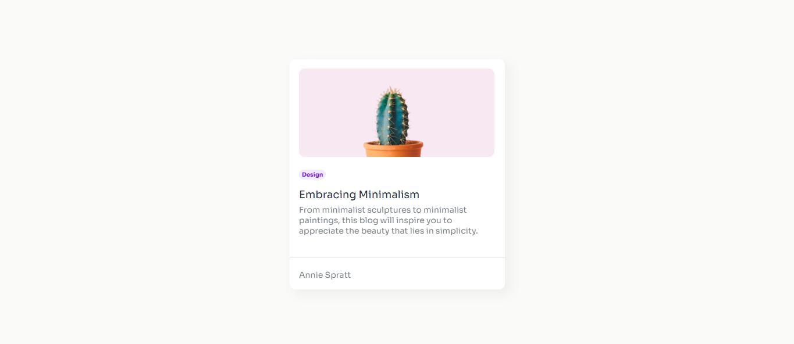

<!-- Please update value in the {}  -->

<h1 align="center">{Minimal Blog Card} | devChallenges</h1>

   Solution for a challenge <a href="https://devchallenges.io/challenge/minimal-blog-card" target="_blank">Minimal Blog Card</a> from <a href="http://devchallenges.io" target="_blank">devChallenges.io</a>.

  <h3>
    <a href="{https://hamdean.github.io/minimal-card/}">
      Demo
    </a>
     | 
    <a href="{https://your-url-to-the-solution}">
      Solution
    </a>
     | 
    <a href="https://devchallenges.io/challenge/minimal-blog-card">
      Challenge
    </a>
  </h3>

<!-- TABLE OF CONTENTS -->

## Table of Contents

- [Table of Contents](#table-of-contents)
- [Overview](#overview)
  - [What I learned](#what-i-learned)
  - [Built with](#built-with)
- [Features](#features)
- [Author](#author)

<!-- OVERVIEW -->

## Overview

### What I learned
- I learnt how to use flexbox to layout elements in one direction
- I also gained some experience in using google fonts

### Built with

- Semantic HTML5 markup
- CSS custom properties
- Flexbox

## Features
This application/site was created as a submission to a [DevChallenges](https://devchallenges.io/challenges-dashboard) challenge.

## Author

- Website [Portfolio site](https://my-portfolio-site-gamma-five.vercel.app/)
- GitHub [Github username](https://{github.com/HamDean})
